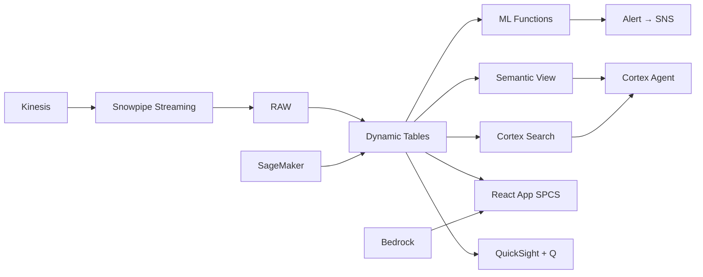

# Export Market Intelligence

AI-powered export market intelligence for Thai food companies — Comprehend extracts trade signals, AI_CLASSIFY categorizes market opportunities, and Cortex Complete generates actionable export briefs for 50+ destination markets.

## Architecture

Thailand exports ฿1.1 trillion in food products to 50+ markets — but trade intelligence is fragmented across government databases, news sources, and competitor reports. AI-native analytics extracts signals, classifies opportunities, and generates strategic briefs — turning information overload into actionable export strategy.



## Snowflake Capabilities

| Capability | Implementation |
|-----------|---------------|
| Dynamic Tables | MARKET_OPPORTUNITY_SCORES / EXPORT_TRENDS / TRADE_BARRIER_TRACKER / COMPETITIVE_POSITION |
| ML Functions | ML.FORECAST + ML.ANOMALY_DETECTION |
| Cortex AI | AI_EXTRACT, AI_CLASSIFY, COMPLETE |
| Cortex Search | 500 documents indexed |
| Cortex Agent | EXPORT_INTEL_AGENT |
| Semantic View | EXPORT_ANALYTICS |
| React App (SPCS) | 5 tabs + DemoGuide |


## AWS Services

| Service | Role in Demo |
|---------|-------------|
| Amazon Comprehend | Extract trade entities and classify signals from 80K news items |
| Amazon Kinesis | Stream real-time trade news and regulatory updates |
| Amazon Bedrock (Claude) | Generate market intelligence briefs and export strategy recommendations |
| Amazon SageMaker | Export demand forecasting by product and market |
| Amazon SNS | Alert trade teams on new barriers and opportunities |
| Amazon QuickSight + Q | Export intelligence dashboard with NL queries |


## Personas

| Persona | Role | Key Questions |
|---------|------|---------------|
| **Apinya Leelanantakul** | VP International Trade | "Which export markets are growing fastest for Thai food?" "What new trade barriers have appeared this quarter?" |
| **Piyawat Tongsomchai** | Trade Intelligence Analyst | "Show me Thailand vs Vietnam shrimp export trends to Japan." "What regulatory changes affect our EU seafood access?" |


## Data

| Table | Rows | Description |
|-------|------|-------------|
| EXPORT_TRANSACTIONS | 350,000 | Thai food export records by product, destination, and value |
| TRADE_SIGNALS | 80,000 | Trade news, regulatory updates, and market reports (unstructured) |
| TARIFF_DATABASE | 25,000 | Import tariff rates by HS code and destination market |
| COMPETITOR_EXPORTS | 200,000 | Competitor country export data (Vietnam, India, Indonesia) |
| MARKET_REGULATIONS | 500 | Import regulations, SPS measures, labeling requirements by market |
| BUYER_CONTACTS | 3,000 | International buyer database with trade history |
| FTA_AGREEMENTS | 45 | Free trade agreements and preferential access terms |
| THAI_EXPORT_CONTEXT | 10 | Thailand food export industry overview |


## Build Instructions

### Prerequisites
- Snowflake account with ACCOUNTADMIN access
- Cortex AI enabled (ML Functions, Search, Agent)
- Warehouse: EXPORT_WH (Medium)
- AWS CLI with access (us-west-2)

### Deployment

```bash
snowsql -f snowflake/00_setup.sql
snowsql -f snowflake/01_marketplace_install.sql
snowsql -f snowflake/02_raw_tables.sql
snowsql -f snowflake/03_staging.sql
snowsql -f snowflake/04_dynamic_tables.sql
snowsql -f snowflake/05_search.sql
snowsql -f snowflake/06_ml_models.sql
snowsql -f snowflake/07_semantic_view.sql
snowsql -f snowflake/08_agent.sql
```

### React App (SPCS)
```bash
cd app && npm ci && npm run build
docker build -t aws-thailand-food-export-intel-app .
docker push bdiqc8sm-default.registry.snowflakecomputing.com/export_intelligence/app/aws_thailand_food_export_intel/app:latest
```

### Demo Mode
Open the app URL with `?demo=true` for presenter view.

## Build Modes

### Snowflake Only
Run scripts 00-08 (skip AWS-specific integration). Uses:
- **AI_EXTRACT + AI_CLASSIFY (native)** instead of Amazon Comprehend
- **Snowpipe Streaming SDK** instead of Amazon Kinesis
- **Cortex Complete** instead of Amazon Bedrock (Claude)
- **ML.FORECAST (native)** instead of Amazon SageMaker
- **Alerts + Notification Integration** instead of Amazon SNS
- **Snowflake Intelligence (Cortex Analyst)** instead of Amazon QuickSight + Q

### Full AWS + Snowflake
Run all scripts including AWS integration. Deploy QuickSight dashboard from `quicksight/`.

## Business Impact

Industry research and Snowflake customer outcomes:
- **Thailand's food exports reached ฿1.1 trillion in 2023, ranking 13th globally** — [National Food Institute Thailand](https://www.nfi.or.th/home-eng.php)
- **AI-powered trade intelligence accelerates market entry decisions by 60% and reduces research costs by 40%** — [McKinsey Global Trade](https://www.mckinsey.com/featured-insights/trade)
- **Thailand has 14 active FTAs covering 80%+ of its food export markets** — [Thai Ministry of Commerce](https://www.moc.go.th/en/)
- **Real-time trade barrier monitoring prevents $5-15M in annual compliance penalties per exporter** — [WTO Trade Facilitation](https://www.wto.org/english/tratop_e/tradfa_e/tradfa_e.htm)
- **Kraft Heinz** (Snowflake customer): built a unified data platform on Snowflake powering supply chain and demand forecasting across 200+ brands -- [snowflake.com/customers/kraft-heinz](https://www.snowflake.com/en/customers/all-customers/case-study/kraft-heinz/)

## Key Demo Numbers

- **฿1.1T** Thai food exports across 50+ destination markets
- **7 barriers** new trade barriers detected this quarter affecting ฿45B
- **12 opportunities** high-potential market-product pairs identified (score > 85)
- **80K signals** trade news items analyzed by AI_EXTRACT + AI_CLASSIFY
- **50+ markets** monitored for opportunities and threats
- **350K transactions** export records analyzed for pattern detection


## License

Apache 2.0 — See [LICENSE](LICENSE) for details.

This is a personal demo project and is not an official Snowflake offering. It comes with no support or warranty.